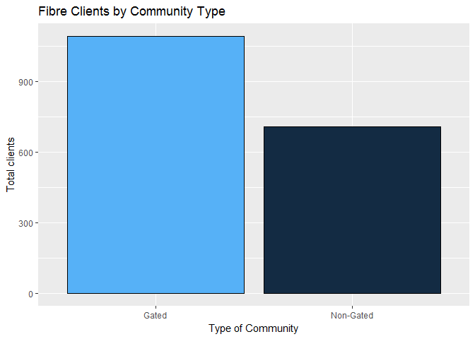
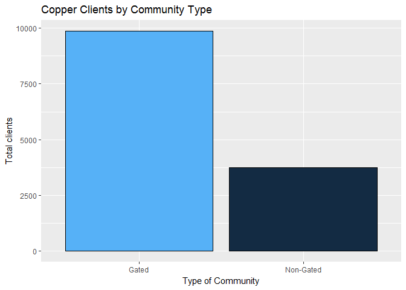
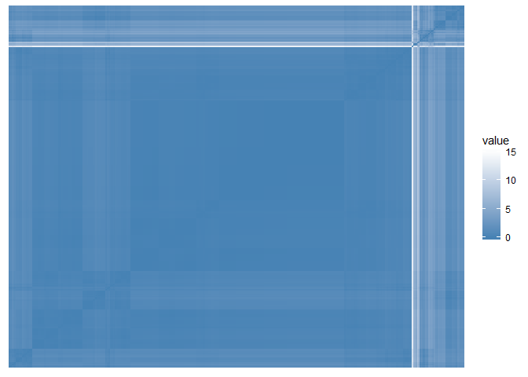
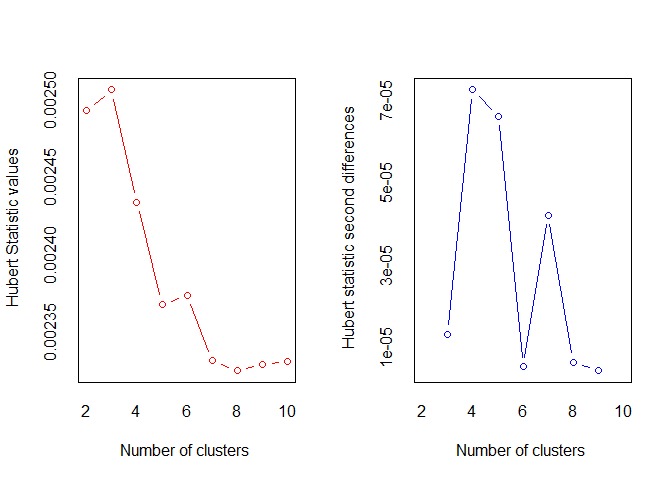
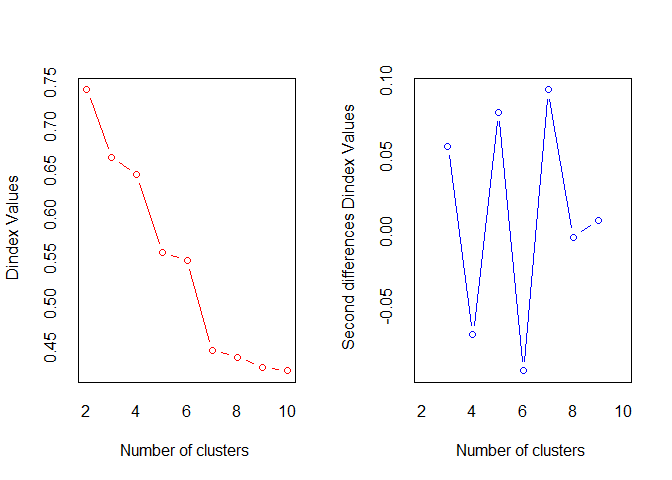
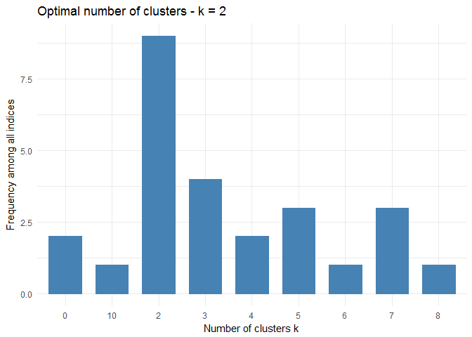
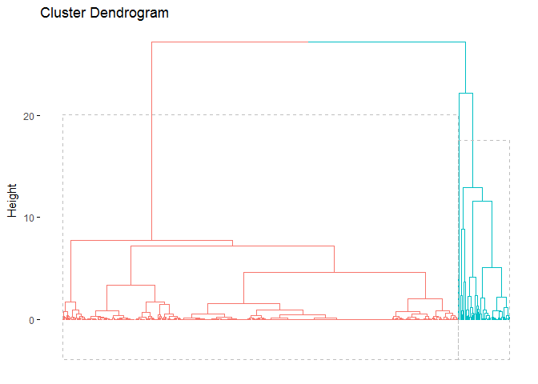
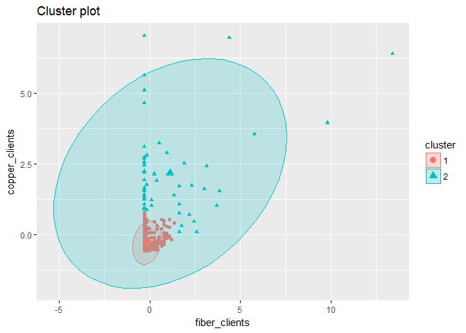
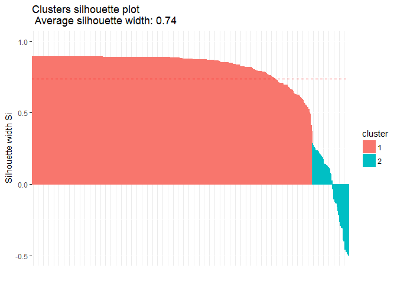

# Take-Up and Client Analysis
SBC Sp z o. o. 
Aug 24, 2017   


# Executive Summary

1. Copper service significantly pre-dominates in gated communities vs. non-gated communities
2. Fibre service has better penetration in gated communities vs. non-gated communities. However, it looks like demand for fiber service has not been saturated in the gated communities yet.
2. There are 475 gated communities with existing customers in the presented exchange area data set
3. Out of those 475 gated communites, 55 communities have significant amout of existing customers ( > 50)
4. It will be rewarding to prioritize further penetration into those 55 gated communities through
+ expedited roll-out of fibre service infrastructure in big gated communities with absolute pre-domination of copper service clientele
+ marketing push to convert existing copper service customers to fibre services in the big gated communities with good penetration of fibre service

# Customer Analysis

## Fiber Clients By Community Type

Below is the bar chart showing the distribution of existing fibre service customers by types of community:
 
<!-- -->

## Copper Clients By Community Type

Below is the bar chart showing the distribution of existing copper service customers by types of community:

<!-- -->

## Clustering Gated Communities by Existing Customers
Out of <b>475</b> gated communities with existing customers, there were identified 2 significant clusters as follows

- gated communities with smaller number of existing customers (<b>420</b> gated communities)
- gated communities with larger number - more then <b>50</b> - of existing customers (<b>55</b> gated communities)

The second cluster is further broken down on two subgroups

- gated communities with prevailing copper service customers
- gated communities with good penetration of fibre service

It would make sense to keep those gated communities in focus to plan for
- expedited roll-out of fibre service infrastructure for gated communities with large number of copper service clients and no significant presence of fibre service customers
- marketing push to convert existing copper service customers to fibre in gated communities with good penetration of fibre service

The list of such communities presented in Appendix B.

Appendix A describes the methodology of cluster analysis implemented.

# Appendix A. Cluster Analysis of Gated Communities by Customers

We went through the common steps suggested by classical cluster analysis, in order to detect meaningful clustering of gated communities by 

1. Data preparation
2. Assessing clustering tendency (i.e., the clusterability of the data)
3. Defining the optimal number of clusters
4. Computing partitioning cluster analyses (e.g.: k-means, pam) or hierarchical clustering analyses
5. Validating clustering analyses: silhouette plot

The sections below wil display detailed results of steps 2-5

## Assessing Cluster Tendency

We can see the gated communities have significant clustering feature, if considering their existing client counts. 

- Hopkins statistic is close to 0 () If the value of Hopkins statistic is close to zero, far below 0.5, then we can conclude that the dataset is significantly clusterable
- VAT (Visual Assessment of cluster Tendency) diagram also supports significant clustering hypothesis (see below)


```
## $hopkins_stat
## [1] 0.02311062
## 
## $plot
```

<!-- -->

## Defining the Optimal Number of Clusters

It has been statistially proven to see 2 significant clusters in client data for gated communities

<!-- -->

```
## *** : The Hubert index is a graphical method of determining the number of clusters.
##                 In the plot of Hubert index, we seek a significant knee that corresponds to a 
##                 significant increase of the value of the measure i.e the significant peak in Hubert
##                 index second differences plot. 
## 
```

<!-- -->

```
## *** : The D index is a graphical method of determining the number of clusters. 
##                 In the plot of D index, we seek a significant knee (the significant peak in Dindex
##                 second differences plot) that corresponds to a significant increase of the value of
##                 the measure. 
##  
## ******************************************************************* 
## * Among all indices:                                                
## * 9 proposed 2 as the best number of clusters 
## * 4 proposed 3 as the best number of clusters 
## * 2 proposed 4 as the best number of clusters 
## * 3 proposed 5 as the best number of clusters 
## * 1 proposed 6 as the best number of clusters 
## * 3 proposed 7 as the best number of clusters 
## * 1 proposed 8 as the best number of clusters 
## * 1 proposed 10 as the best number of clusters 
## 
##                    ***** Conclusion *****                            
##  
## * According to the majority rule, the best number of clusters is  2 
##  
##  
## *******************************************************************
```

```
## Among all indices: 
## ===================
## * 2 proposed  0 as the best number of clusters
## * 9 proposed  2 as the best number of clusters
## * 4 proposed  3 as the best number of clusters
## * 2 proposed  4 as the best number of clusters
## * 3 proposed  5 as the best number of clusters
## * 1 proposed  6 as the best number of clusters
## * 3 proposed  7 as the best number of clusters
## * 1 proposed  8 as the best number of clusters
## * 1 proposed  10 as the best number of clusters
## 
## Conclusion
## =========================
## * According to the majority rule, the best number of clusters is  2 .
```

<!-- -->

## Detecting the Optimal Clustering Algorithm

Based on the statistical analysis performed, it has been proved the hierarchical clustering will work the best for this dataset.


```
## 
## Clustering Methods:
##  hierarchical kmeans diana fanny model sota pam clara agnes 
## 
## Cluster sizes:
##  2 3 4 5 6 
## 
## Validation Measures:
##                                  2       3       4       5       6
##                                                                   
## hierarchical Connectivity   4.4829 12.8056 13.7317 15.2317 16.4317
##              Dunn           0.4545  0.2177  0.3283  0.3283  0.3283
##              Silhouette     0.9161  0.8459  0.8272  0.8252  0.8207
## kmeans       Connectivity   6.7242 21.8623 20.7000 24.2560 25.7560
##              Dunn           0.3104  0.0192  0.0242  0.0296  0.0296
##              Silhouette     0.8984  0.7507  0.7609  0.7505  0.7490
## diana        Connectivity   6.7242  9.0159 22.4198 27.1357 28.4925
##              Dunn           0.3104  0.3673  0.0249  0.0398  0.0414
##              Silhouette     0.8984  0.8611  0.7694  0.7481  0.7295
## fanny        Connectivity  19.3913 36.4083 41.1976 44.7274 56.7655
##              Dunn           0.0038  0.0019  0.0020  0.0020  0.0020
##              Silhouette     0.5307  0.3706  0.3253  0.3576  0.4143
## model        Connectivity  16.9119 50.4698 31.6401 38.4714 36.0310
##              Dunn           0.0019  0.0092  0.0042  0.0042  0.0021
##              Silhouette     0.5257 -0.0776  0.2780  0.2887  0.2508
## sota         Connectivity  12.6806 25.5071 31.0690 33.3607 34.8607
##              Dunn           0.0039  0.0046  0.0064  0.0078  0.0078
##              Silhouette     0.6598  0.6475  0.6540  0.6551  0.6538
## pam          Connectivity  20.4865 46.0083 29.4587 38.1198 48.4480
##              Dunn           0.0019  0.0020  0.0020  0.0022  0.0023
##              Silhouette     0.6421  0.4773  0.5238  0.5708  0.4281
## clara        Connectivity  20.4865 19.5619 46.8885 53.3603 47.0806
##              Dunn           0.0019  0.0040  0.0040  0.0041  0.0021
##              Silhouette     0.6421  0.6709  0.5118  0.4913  0.3527
## agnes        Connectivity   4.4829 12.8056 13.7317 15.2317 16.4317
##              Dunn           0.4545  0.2177  0.3283  0.3283  0.3283
##              Silhouette     0.9161  0.8459  0.8272  0.8252  0.8207
## 
## Optimal Scores:
## 
##              Score  Method       Clusters
## Connectivity 4.4829 hierarchical 2       
## Dunn         0.4545 hierarchical 2       
## Silhouette   0.9161 hierarchical 2
```

## Computing Clusters
Based on the outcomes of the analysis steps above, the two-cluster hierarchical clustering has been implemented.

<!-- --><!-- -->

## Validating clustering analyses: silhouette plot
Validating the computed clusterind demostrated that

- computed clusters are significant from the statistical stand-point
- one of the identified clusters has internal heterogenity and needs to be further scrutinized


```
##   cluster size ave.sil.width
## 1       1  420          0.84
## 2       2   55         -0.03
```

<!-- -->

# Appendix B. Gated Communities with Big Amout of Clients
<table class="t1">
<tr>
<td></td><td>gated_community_id</td><td>copper_clients</td><td>fiber_clients</td></tr>
<tr>
<td>2</td><td class="col">98</td><td class="col">129</td><td class="col">0</td></tr>
<tr>
<td>7</td><td class="col">218</td><td class="col">82</td><td class="col">1</td></tr>
<tr>
<td>51</td><td class="col">5855</td><td class="col">58</td><td class="col">14</td></tr>
<tr>
<td>58</td><td class="55">13815</td><td class="55">58</td><td class="55">0</td></tr>
<tr>
<td>67</td><td>18844</td><td>106</td><td>0</td></tr>
<tr>
<td>81</td><td>25948</td><td>76</td><td>0</td></tr>
<tr>
<td>89</td><td>35218</td><td>95</td><td>4</td></tr>
<tr>
<td>90</td><td>35230</td><td>56</td><td>3</td></tr>
<tr>
<td>95</td><td>56333</td><td>118</td><td>1</td></tr>
<tr>
<td>98</td><td>57282</td><td>53</td><td>0</td></tr>
<tr>
<td>107</td><td>80324</td><td>65</td><td>0</td></tr>
<tr>
<td>122</td><td>118042</td><td>80</td><td>14</td></tr>
<tr>
<td>123</td><td>128004</td><td>262</td><td>34</td></tr>
<tr>
<td>129</td><td>136322</td><td>114</td><td>0</td></tr>
<tr>
<td>133</td><td>140732</td><td>69</td><td>12</td></tr>
<tr>
<td>138</td><td>141414</td><td>78</td><td>0</td></tr>
<tr>
<td>140</td><td>149169</td><td>116</td><td>0</td></tr>
<tr>
<td>143</td><td>149180</td><td>77</td><td>24</td></tr>
<tr>
<td>164</td><td>149449</td><td>52</td><td>0</td></tr>
<tr>
<td>166</td><td>149457</td><td>51</td><td>1</td></tr>
<tr>
<td>168</td><td>149513</td><td>243</td><td>99</td></tr>
<tr>
<td>172</td><td>149582</td><td>105</td><td>25</td></tr>
<tr>
<td>173</td><td>149584</td><td>37</td><td>20</td></tr>
<tr>
<td>175</td><td>149599</td><td>144</td><td>44</td></tr>
<tr>
<td>177</td><td>149602</td><td>24</td><td>14</td></tr>
<tr>
<td>178</td><td>149611</td><td>265</td><td>0</td></tr>
<tr>
<td>180</td><td>149616</td><td>133</td><td>6</td></tr>
<tr>
<td>182</td><td>149618</td><td>87</td><td>5</td></tr>
<tr>
<td>185</td><td>149630</td><td>158</td><td>73</td></tr>
<tr>
<td>190</td><td>149653</td><td>108</td><td>16</td></tr>
<tr>
<td>191</td><td>149656</td><td>99</td><td>0</td></tr>
<tr>
<td>192</td><td>149660</td><td>81</td><td>19</td></tr>
<tr>
<td>198</td><td>149678</td><td>109</td><td>0</td></tr>
<tr>
<td>202</td><td>151699</td><td>198</td><td>0</td></tr>
<tr>
<td>210</td><td>161281</td><td>63</td><td>3</td></tr>
<tr>
<td>216</td><td>173130</td><td>56</td><td>29</td></tr>
<tr>
<td>228</td><td>181017</td><td>74</td><td>0</td></tr>
<tr>
<td>234</td><td>205123</td><td>24</td><td>21</td></tr>
<tr>
<td>242</td><td>229131</td><td>74</td><td>30</td></tr>
<tr>
<td>252</td><td>250883</td><td>52</td><td>0</td></tr>
<tr>
<td>267</td><td>257949</td><td>88</td><td>0</td></tr>
<tr>
<td>281</td><td>278725</td><td>110</td><td>0</td></tr>
<tr>
<td>282</td><td>278726</td><td>67</td><td>0</td></tr>
<tr>
<td>291</td><td>278779</td><td>64</td><td>0</td></tr>
<tr>
<td>294</td><td>278799</td><td>47</td><td>14</td></tr>
<tr>
<td>309</td><td>316162</td><td>32</td><td>15</td></tr>
<tr>
<td>311</td><td>316482</td><td>54</td><td>0</td></tr>
<tr>
<td>340</td><td>319682</td><td>70</td><td>0</td></tr>
<tr>
<td>341</td><td>321602</td><td>54</td><td>0</td></tr>
<tr>
<td>357</td><td>325692</td><td>45</td><td>18</td></tr>
<tr>
<td>375</td><td>338246</td><td>182</td><td>0</td></tr>
<tr>
<td>378</td><td>341761</td><td>97</td><td>0</td></tr>
<tr>
<td>401</td><td>361686</td><td>121</td><td>9</td></tr>
<tr>
<td>403</td><td>363378</td><td>216</td><td>0</td></tr>
<tr>
<td>430</td><td>375485</td><td>98</td><td>0</td></tr>
</table>
